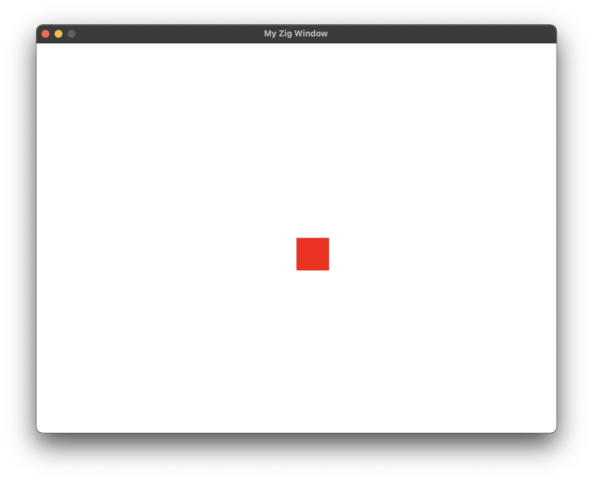

# Simple Zig GUI Demo

A basic GUI application written in Zig using SDL2. This project demonstrates how to create a simple graphical application with Zig, featuring a movable rectangle that responds to keyboard input.



## Features

- Creating a window using SDL2
- Handling keyboard input
- Basic shape rendering
- Game loop implementation
- Proper resource cleanup
- Error handling

## Prerequisites

- Zig (0.11.0 or later)
- SDL2
- macOS with Apple Silicon (M1/M2) or modify paths for your system

### Installation on macOS

```bash
# Install Zig
brew install zig

# Install SDL2
brew install sdl2